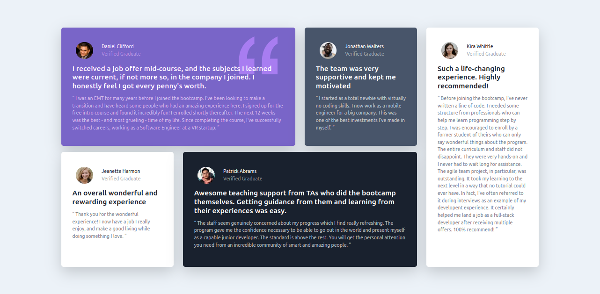

# Frontend Mentor - Testimonials grid section solution

This is a solution to the [Testimonials grid section challenge on Frontend Mentor](https://www.frontendmentor.io/challenges/testimonials-grid-section-Nnw6J7Un7). Frontend Mentor challenges help you improve your coding skills by building realistic projects.

## Table of contents

- [Overview](#overview)
  - [The challenge](#the-challenge)
  - [Screenshot](#screenshot)
  - [Links](#links)
- [My process](#my-process)
  - [Built with](#built-with)
  - [What I learned](#what-i-learned)
  - [Continued development](#continued-development)
  - [Useful resources](#useful-resources)
- [Author](#author)

## Overview

### The challenge

Users should be able to:

- View the optimal layout for the site depending on their device's screen size

### Screenshot



### Links

- Solution URL: [https://github.com/superschooler/testimonials-grid-section-main](https://github.com/superschooler/testimonials-grid-section-main)
- Live Site URL: [https://superschooler.github.io/testimonials-grid-section-main/](https://superschooler.github.io/testimonials-grid-section-main/)

## My process

### Built with

- Semantic HTML5 markup
- [Bootstrap](https://getbootstrap.com/), [Bootstrap](https://getbootstrap.com/), and more [Bootstrap](https://getbootstrap.com/)
- CSS custom properties
- Flexbox
- Mobile-first workflow

### What I learned

I learned a TON about Bootstrap with this project, as I made it a goal to use Bootstrap as much as possible. This was my second time diving into it and there are a lot of very useful things about Bootstrap, but it seems like the project could also go awry quickly since the changes aren't as easily repeatable as simply targeting a class in CSS. I think there's a balance to be had between Bootstrap and CSS and it's up to me to figure out where that is.

I also experiemented with the BEM naming convention, although I didn't get to use it much in CSS due to the extraordinary amount of styling I did with Bootstrap. I like how it keeps the code clean and easy to tell exactly what class you're targeting.

Here's an example of the vast amount of Bootstrap used:

```html
<div class="container p-4">
  <div class="row">
    <div class="col-lg-9">
      <div class="row half-height">
        <div class="col-lg-8 testimonial__padding p-3">
          <div
            class="col-lg-12 testimonial testimonial--purple rounded-3 shadow-lg p-5 position-relative"
          >
            <div class="row testimonial__person align-items-center">
              
            </div>
          </div>
        </div>
      </div>
    </div>
  </div>
</div>
```

My stylesheet was almost exclusively used for colors, positioning the quotation mark, and a hover animation I did on the people's faces just for fun.

There were three main areas that stumped me for a while on the project:

1. I Accidentally forgot an "s" on two class elements inside of the first testimonial card which copied across everything, had me stuck for 20 minutes trying to change text color before I realized my error.

2. I spent over an hour trying to figure out how to get margins / gutters between the tiles without making them move to the next column. After a couple of breaks and a dozen google searches, I ended up nesting each tile in another div and giving it padding.

3. It took a few minutes to figure out how to get the quotation svg behind the text. I tried a lot of things with Z-index and for some reason it only worked when I moved to negative Z-index values.

### Continued development

I loved the use of Bootstrap to set up the flexbox and intend to use it for more layouts in the future. I need to find a happy medium between Bootstrap and CSS, and also want to dabble with Sass very soon.

### Useful resources

- [Bootstrap](https://getbootstrap.com/) - There's no single page that helped me more than the others with Bootstrap - I spent hours reading through the documentation and searching for the proper use of different properties.
- [BEM](http://getbem.com/naming/) - I used the BEM naming convention to the best of my abilities, this website helped refresh my memory on when to use hyphens and when to use underscores.
- [Stack Overflow](https://stackoverflow.com/) - Need I say more?

## Author

- Website - [Add your name here](https://www.your-site.com)
- Frontend Mentor - [@yourusername](https://www.frontendmentor.io/profile/yourusername)
- Twitter - [@yourusername](https://www.twitter.com/yourusername)- Website - [Brian Schooler](https://www.brianschooler.com)
- Frontend Mentor - [@superschooler](https://www.frontendmentor.io/profile/superschooler)
- Twitter - [@superschooler](https://twitter.com/SuperSchooler)
- GitHub - [@superschooler](https://github.com/superschooler)
